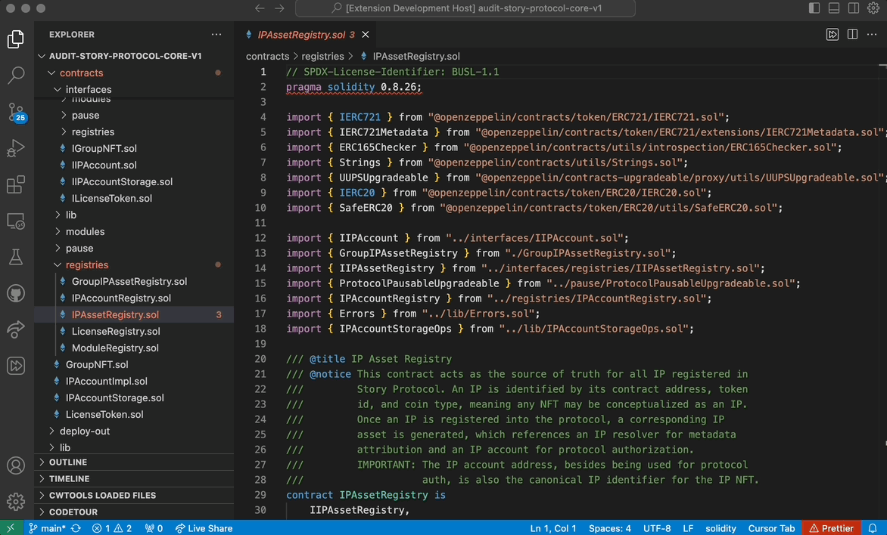

# Installation
Install the UpToSpeed VSCode extension using this link https://marketplace.visualstudio.com/items?itemName=uptospeed.uptospeed or by searching for  `uptospeep` in the marketplace:

# Add a Tour pack
1. Open the correct repo (see product information) in VSCode or Cursor.
2. Use the activity fast-forward ⏩ icon to open UpToSpeed.
3. Click the **Start**  button.
4. Click the **Add** button and select a zip of a package.
5. Enjoy!

# Settings

1. Use the activity fast-forward ⏩ icon to open UpToSpeed.
2. Click Settings link.
3. Adjust the zoom level, the base font, or enable experimental features.

# Feedback

Join our community on [Discord](https://discord.gg/nJr336yF96).

# Where do I get code tours?

## For Auditors

Get your audit packages directly from https://auditlabs.ai

## Others

Please send us an email at hi@up-to-speed.ai

# Problems ? 

Please email us at hi@up-to-speed.ai or write on discord and we will make sure to resolve any issue you might have. 
